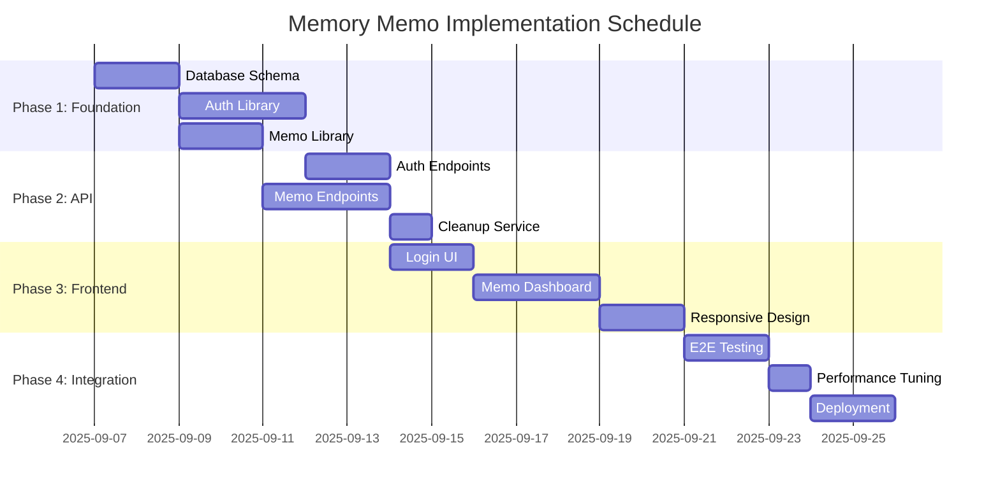

# Memory Memo Implementation Tasks

**Feature**: Personal Memory Memo Application  
**Branch**: 001-web-2-1  
**Generated**: 2025-09-07  
**Based on**: [Feature Specification](../../specs/001-web-2-1/spec.md) | [Implementation Plan](../../specs/001-web-2-1/plan.md)

## 概要

**全タスク数**: 28タスク  
**推定作業時間**: 40-50時間  
**クリティカルパス**: Database Setup → Auth System → Memo Management → Frontend Integration → Deployment  

**完了状況**: 0/28 (0%)

## 実行順序 (Mermaidガントチャート)

---

## Phase 1: Foundation & Models (TDD Required)

### Task 1: Database Schema Setup
- [ ] **タスクタイプ**: DIRECT
- **要件リンク**: FR-001, FR-002, FR-004, FR-005
- **依存タスク**: None (starting point)
- **実装詳細**: 
  - Create SQLite database schema with users, forever_memos, flush_memos tables
  - Add indexes for performance (user_id + created_at)
  - Implement foreign key constraints with CASCADE DELETE
- **完了条件**: 
  - All tables created with proper constraints
  - Database migration scripts work correctly
  - Performance indexes are in place

### Task 2: User Model & Tests
- [ ] **タスクタイプ**: TDD
- **要件リンク**: FR-001, FR-002, FR-003
- **依存タスク**: Task 1
- **実装詳細**:
  - Write failing tests for User creation, validation, authentication
  - Implement User struct with id, username, password_hash, created_at
  - Add username uniqueness validation
  - Implement bcrypt password hashing
- **テスト要件**:
  - Test unique username constraint
  - Test password hashing and verification
  - Test user creation with invalid data
- **完了条件**:
  - All user tests pass
  - Password hashing works correctly
  - Username uniqueness enforced

### Task 3: ForeverMemo Model & Tests
- [ ] **タスクタイプ**: TDD
- **要件リンク**: FR-004, FR-007, FR-008, FR-010
- **依存タスク**: Task 2
- **実装詳細**:
  - Write failing tests for ForeverMemo CRUD operations
  - Implement ForeverMemo struct with id, user_id, content, created_at
  - Add user isolation (users can only access own memos)
  - Implement ordering by created_at DESC
- **テスト要件**:
  - Test memo creation and retrieval
  - Test user isolation (can't access other user's memos)
  - Test ordering (newest first)
- **完了条件**:
  - All ForeverMemo tests pass
  - User isolation works correctly
  - Proper ordering implemented

### Task 4: FlushMemo Model & Tests
- [ ] **タスクタイプ**: TDD
- **要件リンク**: FR-005, FR-006, FR-007, FR-008, FR-009
- **依存タスク**: Task 3
- **実装詳細**:
  - Write failing tests for FlushMemo CRUD and expiration logic
  - Implement FlushMemo struct with id, user_id, content, created_at, expires_at
  - Add automatic expires_at calculation (created_at + 24 hours)
  - Implement expiration filtering logic
- **テスト要件**:
  - Test memo creation with automatic expiration date
  - Test expiration filtering (expired memos not returned)
  - Test user isolation for flush memos
- **完了条件**:
  - All FlushMemo tests pass
  - Expiration logic works correctly
  - 24-hour expiry automatically set

---

## Phase 2: Libraries & Services (TDD Required)

### Task 5: Auth Library Implementation
- [ ] **タスクタイプ**: TDD
- **要件リンク**: FR-001, FR-002, FR-003
- **依存タスク**: Task 2
- **実装詳細**:
  - Create auth-lib crate with register/login/logout functions
  - Implement session-based authentication
  - Add password validation rules
  - Create CLI interface (auth-cli --register/--login)
- **テスト要件**:
  - Test user registration with duplicate username
  - Test login with invalid credentials
  - Test session creation and validation
- **完了条件**:
  - Library tests pass
  - CLI commands work
  - Session management functional

### Task 6: Memo Library Implementation
- [ ] **タスクタイプ**: TDD
- **要件リンク**: FR-004, FR-005, FR-007, FR-008, FR-010
- **依存タスク**: Task 3, Task 4
- **実装詳細**:
  - Create memo-lib crate for memo CRUD operations
  - Implement list_memos (flush first, then forever, newest first in each)
  - Add create_forever_memo and create_flush_memo functions
  - Create CLI interface (memo-cli --create/--list/--delete)
- **テスト要件**:
  - Test memo listing order (flush first, newest first within type)
  - Test memo creation for both types
  - Test memo deletion
- **完了条件**:
  - All memo operations work correctly
  - Proper ordering implemented
  - CLI interface functional

### Task 7: Cleanup Service Library
- [ ] **タスクタイプ**: TDD
- **要件リンク**: FR-009
- **依存タスク**: Task 4
- **実装詳細**:
  - Create cleanup-lib crate for flush memo expiration
  - Implement cleanup function to remove expired flush memos
  - Add scheduling/cron functionality
  - Create CLI interface (cleanup-cli --run/--schedule)
- **テスト要件**:
  - Test cleanup removes only expired memos
  - Test cleanup preserves non-expired memos
  - Test cleanup runs without errors
- **完了条件**:
  - Cleanup logic works correctly
  - No data loss for valid memos
  - CLI interface functional

---

## Phase 3: API Endpoints (Contract Tests First)

### Task 8: Auth API Contract Tests
- [ ] **タスクタイプ**: TDD
- **要件リンク**: FR-001, FR-002, FR-003
- **依存タスク**: Task 5
- **実装詳細**:
  - Write failing contract tests for /auth/register, /auth/login, /auth/logout
  - Test request/response schemas match OpenAPI spec
  - Test error cases (duplicate username, invalid credentials)
- **テスト要件**:
  - POST /auth/register returns 201 on success, 409 on duplicate
  - POST /auth/login returns 200 on success, 401 on invalid credentials
  - POST /auth/logout returns 200 and invalidates session
- **完了条件**:
  - All contract tests fail initially (RED phase)
  - Tests properly validate API contracts
  - Error scenarios covered

### Task 9: Auth API Implementation
- [ ] **タスクタイプ**: TDD (making Task 8 tests pass)
- **要件リンク**: FR-001, FR-002, FR-003
- **依存タスク**: Task 8
- **実装詳細**:
  - Implement Axum routes for auth endpoints
  - Add session management with HTTP-only cookies
  - Integrate with auth-lib functions
  - Add proper error handling and status codes
- **エラーハンドリング要件**:
  - Return 409 for duplicate usernames
  - Return 401 for invalid credentials
  - Return 400 for malformed requests
- **完了条件**:
  - All contract tests pass (GREEN phase)
  - Proper HTTP status codes returned
  - Session cookies set correctly

### Task 10: Memo API Contract Tests
- [ ] **タスクタイプ**: TDD
- **要件リンク**: FR-004, FR-005, FR-006, FR-007, FR-008
- **依存タスク**: Task 6
- **実装詳細**:
  - Write failing contract tests for memo endpoints
  - Test GET /memos returns properly ordered memos
  - Test POST /memos/forever and /memos/flush creation
  - Test DELETE /memos/{id} memo deletion
- **テスト要件**:
  - GET /memos returns 401 without authentication
  - POST endpoints return 201 on success, 401 without auth
  - DELETE returns 200 on success, 404 for non-existent/unauthorized
- **完了条件**:
  - All contract tests fail initially
  - Request/response schemas validated
  - Authorization checks included

### Task 11: Memo API Implementation
- [ ] **タスクタイプ**: TDD (making Task 10 tests pass)
- **要件リンク**: FR-004, FR-005, FR-006, FR-007, FR-008, FR-010
- **依存タスク**: Task 10
- **実装詳細**:
  - Implement Axum routes for memo endpoints
  - Add authentication middleware
  - Integrate with memo-lib functions
  - Ensure proper ordering (flush first, newest first within type)
- **エラーハンドリング要件**:
  - Return 401 for unauthenticated requests
  - Return 404 for non-existent or unauthorized memos
  - Return 400 for empty memo content
- **完了条件**:
  - All contract tests pass
  - Proper memo ordering implemented
  - User isolation enforced

---

## Phase 4: Frontend Implementation

### Task 12: Base HTML Structure
- [ ] **タスクタイプ**: DIRECT
- **要件リンク**: Design requirements from constitution
- **依存タスク**: None (can be done in parallel)
- **実装詳細**:
  - Create index.html with login/register forms
  - Add dashboard.html for memo management
  - Include Inter and Noto Sans JP font imports
  - Set up basic CSS structure with minimal flat design
- **UI/UX要件**:
  - Mobile-first responsive design
  - Large whitespace and few colors
  - Clean typography with specified fonts
- **完了条件**:
  - HTML validates correctly
  - Fonts load properly
  - Basic responsive layout works

### Task 13: Login/Register UI & Forms
- [ ] **タスクタイプ**: DIRECT
- **要件リンク**: FR-001, FR-002, FR-003
- **依存タスク**: Task 12, Task 9
- **実装詳細**:
  - Create login/register forms with proper validation
  - Add JavaScript for form submission to auth API
  - Implement error message display
  - Add session management (redirect after login)
- **UI/UX要件**:
  - Clear form validation messages
  - Accessible form labels and inputs
  - WCAG 2.1 AA compliance
- **エラーハンドリング要件**:
  - Display user-friendly error messages
  - Handle network errors gracefully
  - Show loading states during requests
- **完了条件**:
  - Forms submit to API correctly
  - Error messages display properly
  - Session redirect works

### Task 14: Memo Dashboard UI
- [ ] **タスクタイプ**: DIRECT
- **要件リンク**: FR-004, FR-005, FR-006, FR-007
- **依存タスク**: Task 13, Task 11
- **実装詳細**:
  - Create memo dashboard with two sections (flush memos on top)
  - Add forms for creating forever and flush memos
  - Implement memo listing with proper ordering
  - Add delete functionality for memos
- **UI/UX要件**:
  - Clear visual distinction between memo types
  - Newest memos first within each section
  - Easy-to-use creation and deletion controls
- **完了条件**:
  - Dashboard displays memos correctly
  - Memo creation/deletion works
  - Visual hierarchy matches requirements

### Task 15: HTMX Integration
- [ ] **タスクタイプ**: DIRECT
- **要件リンク**: Performance requirements (<200ms)
- **依存タスク**: Task 14
- **実装詳細**:
  - Add HTMX library for dynamic updates
  - Implement partial page updates for memo operations
  - Add optimistic UI updates for better user experience
  - Minimize JavaScript for simplicity
- **完了条件**:
  - HTMX updates work correctly
  - Page performance meets <200ms requirement
  - Minimal JavaScript footprint

### Task 16: Responsive Design Implementation
- [ ] **タスクタイプ**: DIRECT
- **要件リンク**: Constitutional UI requirements
- **依存タスク**: Task 15
- **実装詳細**:
  - Implement mobile-first CSS with breakpoints
  - Test on various screen sizes
  - Ensure touch targets are appropriately sized
  - Add accessibility improvements
- **UI/UX要件**:
  - Works on mobile, tablet, desktop
  - Touch-friendly interface
  - Keyboard navigation support
  - WCAG 2.1 AA compliance
- **完了条件**:
  - Responsive design works across devices
  - Accessibility audit passes
  - Touch interactions work properly

---

## Phase 5: Integration & Testing

### Task 17: End-to-End Integration Tests
- [ ] **タスクタイプ**: TDD
- **要件リンク**: All functional requirements
- **依存タスク**: Task 16
- **実装詳細**:
  - Write E2E tests covering complete user journeys
  - Test user registration → login → memo creation → memo management
  - Verify flush memo expiration after 24 hours
  - Test error scenarios and edge cases
- **テスト要件**:
  - Complete user flow from registration to memo management
  - Flush memo expiration validation
  - Cross-browser compatibility
- **完了条件**:
  - All E2E tests pass
  - User journeys work end-to-end
  - Performance meets constitutional requirements

### Task 18: Performance Testing & Optimization
- [ ] **タスクタイプ**: DIRECT
- **要件リンク**: Constitutional performance requirements (<200ms)
- **依存タスク**: Task 17
- **実装詳細**:
  - Run performance tests on all API endpoints
  - Optimize database queries with proper indexes
  - Minimize frontend asset sizes
  - Test under load conditions
- **完了条件**:
  - All endpoints respond in <200ms
  - Database queries are optimized
  - Frontend loads quickly
  - Load testing passes

### Task 19: Security Testing
- [ ] **タスクタイプ**: DIRECT
- **要件リンク**: FR-008, Constitutional privacy requirements
- **依存タスク**: Task 18
- **実装詳細**:
  - Test user isolation (users can't access other users' data)
  - Validate session management security
  - Test for common web vulnerabilities (CSRF, XSS)
  - Verify password security practices
- **完了条件**:
  - User isolation is enforced
  - No security vulnerabilities found
  - Session management is secure
  - Passwords are properly hashed

---

## Phase 6: Deployment & Operations

### Task 20: Docker Configuration
- [ ] **タスクタイプ**: DIRECT
- **要件リンク**: Deployment requirements
- **依存タスク**: Task 19
- **実装詳細**:
  - Create Dockerfile for Rust backend
  - Create docker-compose.yml with backend and database
  - Add frontend serving configuration
  - Test local Docker deployment
- **完了条件**:
  - Docker builds successfully
  - Application runs in containers
  - Local deployment works

### Task 21: Caddy Configuration
- [ ] **タスクタイプ**: DIRECT
- **要件リンク**: HTTPS deployment at rikumiura.com/memory_memo
- **依存タスク**: Task 20
- **実装詳細**:
  - Configure Caddy for reverse proxy
  - Set up automatic HTTPS for rikumiura.com/memory_memo
  - Add proper headers and security configuration
  - Test SSL certificate generation
- **完了条件**:
  - Caddy serves application correctly
  - HTTPS works with automatic certificates
  - Security headers are set

### Task 22: VPS Deployment Setup
- [ ] **タスクタイプ**: DIRECT
- **要件リンク**: Production deployment
- **依存タスク**: Task 21
- **実装詳細**:
  - Set up VPS with Docker and Docker Compose
  - Configure systemd services for automatic startup
  - Set up log rotation and monitoring
  - Test production deployment
- **完了条件**:
  - VPS deployment works
  - Services start automatically
  - Monitoring is in place

### Task 23: CI/CD Pipeline
- [ ] **タスクタイプ**: DIRECT
- **要件リンク**: Automated deployment
- **依存タスク**: Task 22
- **実装詳細**:
  - Create GitHub Actions workflow
  - Add automated testing on push
  - Set up automatic deployment to VPS
  - Add deployment notifications
- **完了条件**:
  - CI/CD pipeline works
  - Tests run automatically
  - Deployment is automated

---

## Phase 7: Monitoring & Cleanup

### Task 24: Logging & Monitoring Setup
- [ ] **タスクタイプ**: DIRECT
- **要件リンク**: Constitutional observability requirements
- **依存タスク**: Task 23
- **実装詳細**:
  - Add structured logging with tracing crate
  - Set up log aggregation and rotation
  - Add basic monitoring dashboard
  - Configure error alerting
- **完了条件**:
  - Structured logging works
  - Logs are properly rotated
  - Monitoring provides useful insights

### Task 25: Automated Flush Memo Cleanup
- [ ] **タスクタイプ**: DIRECT
- **要件リンク**: FR-009
- **依存タスク**: Task 7, Task 24
- **実装詳細**:
  - Set up cron job or systemd timer for cleanup
  - Configure cleanup to run every hour
  - Add logging for cleanup operations
  - Test cleanup process doesn't impact performance
- **完了条件**:
  - Cleanup runs automatically
  - Expired memos are removed
  - No performance impact on live system

### Task 26: Backup & Recovery
- [ ] **タスクタイプ**: DIRECT
- **要件リンク**: Data reliability requirements
- **依存タスク**: Task 25
- **実装詳細**:
  - Set up automated database backups
  - Test backup restoration process
  - Document recovery procedures
  - Set up backup monitoring
- **完了条件**:
  - Automated backups work
  - Recovery process tested
  - Documentation is complete

---

## Phase 8: Validation & Launch

### Task 27: Quickstart Validation
- [ ] **タスクタイプ**: DIRECT
- **要件リンク**: All requirements validation
- **依存タスク**: Task 26
- **実装詳細**:
  - Execute complete quickstart.md validation
  - Test all user scenarios and acceptance criteria
  - Verify performance meets constitutional requirements
  - Confirm accessibility compliance
- **完了条件**:
  - All quickstart tests pass
  - Performance requirements met
  - No critical issues found

### Task 28: Production Launch
- [ ] **タスクタイプ**: DIRECT
- **要件リンク**: Full system deployment
- **依存タスク**: Task 27
- **実装詳細**:
  - Deploy to production at https://rikumiura.com/memory_memo
  - Monitor system stability for first 24 hours
  - Verify all functionality works in production
  - Document any issues and resolutions
- **完了条件**:
  - Application is live and accessible
  - All features work in production
  - System is stable
  - Monitoring shows healthy metrics

---

## サブタスクテンプレート情報

各タスクは以下のサブタスクに分解できます：

### TDDタスクのサブタスク
1. **RED**: Write failing tests
2. **GREEN**: Implement minimal code to pass tests  
3. **REFACTOR**: Clean up and optimize code
4. **INTEGRATE**: Ensure integration with other components

### DIRECTタスクのサブタスク
1. **PLAN**: Define detailed implementation approach
2. **IMPLEMENT**: Write the code/configuration
3. **TEST**: Verify functionality works correctly
4. **DOCUMENT**: Update relevant documentation

## 完了確認チェックリスト

- [ ] すべてのタスクにチェックボックスが含まれている
- [ ] タスクタイプ（TDD/DIRECT）が明記されている
- [ ] 要件リンクが正しく設定されている
- [ ] 依存タスクが適切に定義されている
- [ ] 実装詳細が具体的に記述されている
- [ ] テスト要件が明確になっている（TDDタスク）
- [ ] UI/UX要件が含まれている（フロントエンドタスク）
- [ ] エラーハンドリング要件が定義されている
- [ ] 完了条件が測定可能である
- [ ] 実行順序が論理的である
- [ ] 推定作業時間が現実的である